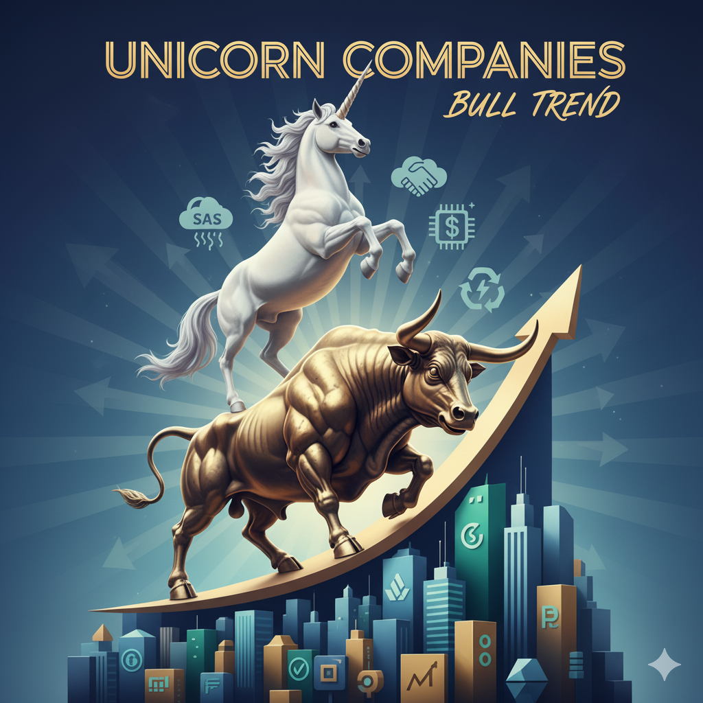

# UnicornCompany-DA_Spark-sql-ml
Unicorn Companies Valuation Prediction
# 🦄 Unicorn Companies Valuation Prediction

## Project Overview
This project predicts the valuation of unicorn companies (private companies valued over $1B) using historical data on company characteristics, industry trends, investor information, and founding details.  
The goal is to provide insights into which factors most influence high valuations and to forecast potential future unicorns.

---

## Key Learnings / Insights
- Unicorn valuations are **highly skewed** → log‑transformation can improve predictive performance.
- **Investor networks, industry, and company age** are significant predictors.
- **Small datasets** and **sparse multi‑valued categorical features** make accurate prediction challenging.
- Spark ML pipelines efficiently handle **complex feature engineering** and **large categorical encodings**.

---

## Future Improvements
- Apply **log‑transform** to target valuation to reduce skew.
- Explore **Gradient Boosted Trees** or **XGBoost** for improved performance.
- Include **macroeconomic / market trend data** for enhanced prediction.
- Optimize **multi‑investor encoding** for better generalization.

---

## Technologies Used
- **Apache Spark / PySpark**
- **Spark ML** (`RandomForestRegressor`, `VectorAssembler`, `CountVectorizer`, `OneHotEncoder`)
- **Python**
